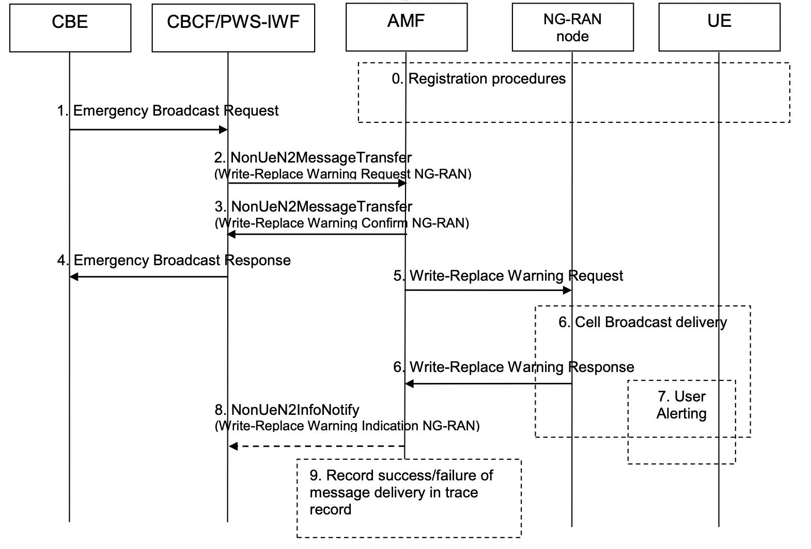
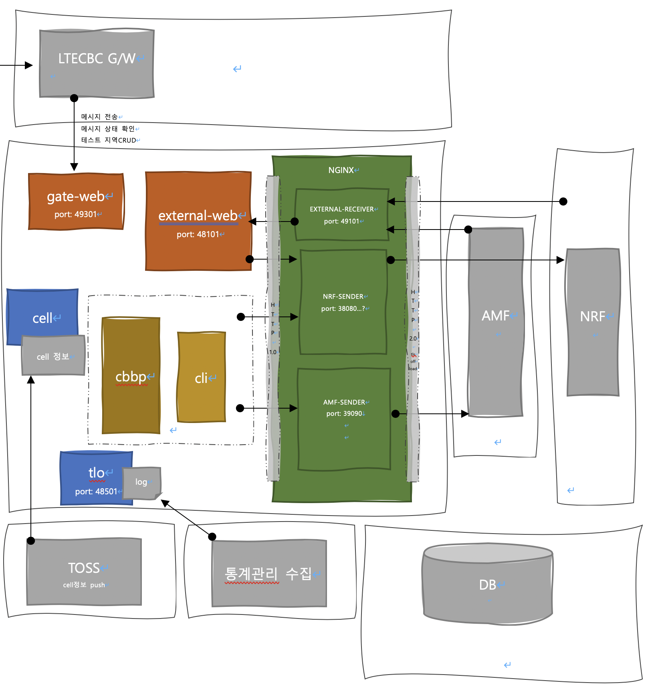

통신사에 긴급 재난문자 보내기 5G (disaster alert, cell broadcast service)
=====

이 문서에서는 기관에서 통신사를 통해 고객들에게 긴급 재난문자를 보내는 흐름 및 프로젝트 코드를 기술한다.


## 흐름도
- 국가 재난망 → 통신사(CBCF) → AMF →  기지국(NODE) → 휴대폰(UE)
  
[3GPP 23041-g20, 9.1.3.5.2	Warning Message Delivery Procedure](https://portal.3gpp.org/desktopmodules/Specifications/SpecificationDetails.aspx?specificationId=748)

데이터 흐름이 진행된다. 
여기서 우리는 ***[국가 재난망 → 통신사(CBCF) → AMF]*** 이부분에서의 ***통신사(CBCF)*** 의 프로젝트 구성 및 코드를 알아볼것이다.

<br><br>

CBCF
-----  
## 프로세스들
1. gate-web
   - 국가재난망에서의 요청 메시지를 처리한다.
2. external-web
   - NRF(Network Repository Function)와 통신하여 메시지를 보낼 기저데이터들을 갱신 및 관리한다.
3. cell
   - 통신사에서 제공받은 기지국의 데이터를 파싱 및 DB를 현행화한다.
4. cbpp
   - 메시지를 AMF(Access and Mobility Management Function)에 전송한다.
5. cli
   - 운영관리에 필요한 기능을 제공한다.
6. tlo
   - 모든 프로세스들을 시스템 감지처리할수있도록 로그를 수집 한다.

  

<br><br>

## 프로젝트 셋팅 (gradle)
gradle multi module project  
- setting.gradle  
    ```gradle
    rootProject.name = 'cbcf-5g'
    String[] cores = ['core', 'external-communication-core']
    String[] modules = ['cbpp', 'cli', 'tlo', 'cell']
    String[] webModules = ['gate-web', 'external-web']
    String[] toolModules = ['dummy-namf', 'dummy-nnrf', 'tool']
    ...
    ```
- build.gradle
    ```gradle    
    allprojects {...}
    subprojects { subprojects ->
        ...
        dependencies {
            ...
        }
    }
    project(':cbpp') {
        dependencies {
            compile project(':core')
            compile project(':external-communication-core')
        }
    }
    project(':cli') {
        dependencies {
            compile project(':core')
            compile project(':external-communication-core')
        }
    }
    project(':cell') {
        dependencies {
            compile project(':core')
        }
    }
    project(':tlo') {
        dependencies {
            compile project(':core')
        }
    }
    project(':gate-web') {
        dependencies {
            compile project(':core')
            compile project(':external-communication-core')
        }
    }
    project(':external-web') {
        dependencies {
            compile project(':core')
            compile project(':external-communication-core')
        }
    }
    project(':dummy-nnrf') {
        dependencies {
            compile project(':core')
            compile project(':external-communication-core')
        }
    }
    project(':dummy-namf') {
        dependencies {
            compile project(':core')
            compile project(':external-communication-core')
        }
    }
    project(':external-communication-core') {
        dependencies {
            compile project(':core')
        }
    }
    ```


# gate-web
국가재난망에서의 요청 메시지를 처리한다.
- spring web project
- 역할
  - 테스트 송출지역 조회
  - 테스트 송출지역 추가
  - 테스트 송출지역 삭제
  - 송출 메시지 수신
  - 송출 결과 조회  
  
- controller
   ```java
    @RestController
    @RequestMapping(CbcfV1Controller.URI_PREFIX)
    public class CbcfV1Controller {
        // ...
        public static final String URI_PREFIX = "/cbcf/v1";

        // 테스트 송출지역 조회
        @GetMapping("/cell/test/read")
        public List<Map<String, String>> read() {
            ...
        }

        // 테스트 송출지역 추가
        @PostMapping("/cell/test/create")
        @ResponseBody
        public Msg saveCell(@RequestBody Map<String, Object> cellJson) {
            ...
        }

        // 테스트 송출지역 삭제
        @DeleteMapping("/cell/test/delete/{cell_seq}")
        public Msg deleteCell(@PathVariable Long cell_seq) {
            ...
        }

        // 송출 메시지 수신
        @PostMapping("/msg/send")
        @ResponseBody
        @Tlog
        public Msg sendMsg(@RequestBody Map<String, Object> msgJson) {
            ...
        }

        // 송출 결과 조회
        @GetMapping("/msg/result/{ltecbc_msg_seq}")
        public Object readMsg(@PathVariable Long ltecbc_msg_seq) {
            ...
        }
    }
   ```

# external-web
NRF(Network Repository Function)와 통신하여 메시지를 보낼 기저데이터들을 갱신 및 관리한다.  
- spring project
- 통신사의 NRF 이중화 구성  
  - master (예: 상암)  
    - order1 nrf  
    - order2 nrf  
  - secondary (예: 대전)  
    - order1 nrf  
    - order2 nrf  
- AMF 정보
  - NRF에서 받아온 AMF정보는 여러개 (처리 지역 tai range에 따라)

- 역할
  - NRF에 heartBeat를 보낸다.
  - NRF에 subscriptions를 처리한다.  유효기간에 맞춰 다시 subscription(AMF정보)
  - NRF에 AMF에 전송시 필요한 oauth2Token를 받는다. 유효기간에 맞춰 갱신 한다.
  - NRF에 AMF의 정보를 요청하여 갱신한다.
  - 이중화 구성된 NRF에 regustered, subscription, discovery, oauth2Token 및 일괄적인 처리한다.  
  
- scheduler
    ```java
    @Component
    @Slf4j
    public class Scheduler {
        // ...
        // NRF에 heartBeat를 보낸다.
        @Tlog(success = TloCode.SUCCESS_HeartBeat_EXTERNALWEB)
        @ApiOperation(value = CbcfProcessOperator.EXTERNAL_WEB_NRF_HEARTBEAT)
        @Scheduled(cron = "${project.schedulers." + CbcfProcessOperator.EXTERNAL_WEB_NRF_HEARTBEAT + ".cron}")
        public void heartbeat() throws Throwable {
          ...
        }

        // NRF에 subscriptions를 처리한다.  유효기간에 맞춰 다시 subscription(AMF정보)
        @Tlog(success = TloCode.SUCCESS_Subscriptions_EXTERNALWEB)
        @ApiOperation(value = CbcfProcessOperator.EXTERNAL_WEB_NRF_SUBSCRIPTIONS)
        @Scheduled(cron = "${project.schedulers." + CbcfProcessOperator.EXTERNAL_WEB_NRF_SUBSCRIPTIONS + ".cron}")
        public void subscription() throws Throwable {
          ...
        }

        // NRF에 AMF에 전송시 필요한 oauth2Token를 받는다. 유효기간에 맞춰 갱신 한다.
        @Tlog(success = TloCode.SUCCESS_Oauth2Token_EXTERNALWEB)
        @ApiOperation(value = CbcfProcessOperator.EXTERNAL_WEB_NRF_OAUTH2_TOKEN)
        @Scheduled(cron = "${project.schedulers." + CbcfProcessOperator.EXTERNAL_WEB_NRF_OAUTH2_TOKEN + ".cron}")
        public void oauth2Token() throws Throwable {
           ...
        }

        // NRF에 AMF의 정보를 요청하여 갱신한다.
        public void discovery() throws Throwable {
            ...
        }
        
        // 이중화 구성된 NRF에 regustered, subscription, discovery, oauth2Token 및 일괄적인 처리한다.
        @ApiOperation(value = CbcfProcessOperator.JOB)
        @Scheduled(cron = "${project.schedulers." + CbcfProcessOperator.JOB + ".cron}")
        @Tlog
        public void job() throws Throwable {
            ... 
            NFProfile activeNrf = null;
            EcoreNrfInfo activeNrfInfo = null;
            for (int i = 0; null != nrfs && i < nrfs.size(); i++) {
                EcoreNrfInfo nrfInfo = nrfs.get(i);
                NFProfile nfProfile = null;
                // 처음에 CBCF instance ID로 조회를 해본다.
                try {
                    if (null == activeNrf) {
                        nfProfile = ecService.getNFProfileAtNrf(cbcf, nrfInfo);
                        log.info("job get NFProfile success {}", nfProfile);
                    }
                } catch (Throwable throwable) {
                }

                // 조회결과가 없거나 있더라도 상태가 Registered가 아니면 Register 한다.
                if (null == activeNrf && (null == nfProfile || NFStatus.REGISTERED != nfProfile.getNfStatus())) {
                    nfProfile = ecService.putNFProfileRegisterAtNrf(cbcf, nrfInfo);
                    log.info("job put NFProfile success {}", nfProfile);
                }

                // 처음 Registered인 NFProfile 선택후 작업을한다.
                if (null == activeNrf && null != nfProfile && NFStatus.REGISTERED == nfProfile.getNfStatus()) {
                    NFProfile finalNfProfile = nfProfile;
                    ecoreNrfInfoService.updateStatus(nrfInfo.getNrfSeq(), NrfStatus.A);

                    EcoreNrfInfoProcess nrfInfoProcess = ecoreNrfInfoProcessService.mergeByCbcfSeqAndNrfInfoSeq(cbcf.getCbcfSeq(), nrfInfo.getNrfInfoSeq(), (EcoreNrfInfoProcess it) -> {
                        it.setHeartBeattimmer(finalNfProfile.getHeartBeatTimer());
                        it.setStatus(NrfStatus.A);
                    });

                    //subscriptions  add nfStatusNotificationUri
                    if (Strings.isBlank(nrfInfoProcess.getSubscriptionId())) {
                        SubscriptionData rcvSubscriptionData = ecService.postSubscriptionsToAmfAtNrf(nrfInfo);
                        nrfInfoProcess = ecoreNrfInfoProcessService.mergeByCbcfSeqAndNrfInfoSeq(cbcf.getCbcfSeq(), nrfInfo.getNrfInfoSeq(), (it) -> {
                            it.setSubscriptionId(rcvSubscriptionData.getSubscriptionId());
                            it.setSubscriptionValidityTime(Date.from(rcvSubscriptionData.getValidityTime().toInstant()));
                            it.setSubscriptionDt(new Date());
                            it.setStatus(NrfStatus.A);
                        });
                        log.info("job get Subscriptions success {}", rcvSubscriptionData);
                    }
                    //oauth2 token
                    if (Strings.isBlank(nrfInfoProcess.getAmfCommAccessToken())) {
                        Oauth2Token rcvOauth2TokenData = ecService.postOauth2RegisterToNamfComAtNrf(cbcf, nrfInfo);
                        mergeOauth2TokenAndStatusA(rcvOauth2TokenData, cbcf, nrfInfo);
                        log.info("job post Oauth2 token success {}", rcvOauth2TokenData);
                    }

                    // 처음에 register된 또는 register되어있던 프로세스 처음구동됐을때 nrf를 처음에 한번 discovery한다.
                    if (!nrfInfoProcess.getNrfInfoProcessSeq().equals(this.firstRegisterNrfInfoProcessSeq)) {
                        SearchResult searchResult = ecService.getDiscoveryToAmfAtNrf(nrfInfo);
                        ecService.mergeAmfInfos(searchResult);
                        log.info("job get Discovery success {}", searchResult);
                        this.firstRegisterNrfInfoProcessSeq = nrfInfoProcess.getNrfInfoProcessSeq();
                    }
                    activeNrf = finalNfProfile;
                    activeNrfInfo = nrfInfo;
                } else {
                    ecoreNrfInfoService.updateStatus(nrfInfo.getNrfSeq(), NrfStatus.W);
                    ecoreNrfInfoProcessService.mergeByCbcfSeqAndNrfInfoSeq(cbcf.getCbcfSeq(), nrfInfo.getNrfInfoSeq(), (it) -> it.setStatus(NrfStatus.W));
                }
            }
        }

    }
    ```

# cell
통신사에서 제공받은 기지국의 데이터를 파싱 및 DB를 현행화한다.
- spring project
- 역할
  - 통신사에서 제공받은 기지국의 데이터를 파싱 및 DB를 현행화한다.
- schudler
  ```java
    @Component
    @Slf4j
    public class Scheduler {
        // 통신사에서 제공받은 기지국의 데이터를 파싱 및 DB를 현행화한다.
        @ApiOperation(value = CbcfProcessOperator.JOB)
        @Scheduled(cron = "${project.schedulers."+CbcfProcessOperator.JOB+".cron}")
        @Tlog(success = TloCode.SUCCESS_Job_CELL)
        public void job() throws Throwable {
            // ...
        }
    }

  ```

# cbpp
메시지를 AMF(Access and Mobility Management Function)에 전송한다.
- spring project
- 역할

- schudler
  ```java
    @Component
    @Slf4j
    public class Scheduler {
        // ...
        // 전송 메시지 조회후 AMF에 전송한다.
        @ApiOperation(value = CbcfProcessOperator.JOB)
        @Scheduled(cron = "${project.schedulers." + CbcfProcessOperator.JOB + ".cron}")
        @Tlog//(success = TloCode.SUCCESS_Job_CBPP)
        public void job() throws Throwable {
            //..
            List<Msg> msgs = Optional.ofNullable(msgService.findByCbcfSeqAndStatusAndReserveDtLessThanOrderByReserveDt(cbcf.getCbcfSeq(), MsgStatus.W, new Date())).orElse(Collections.emptyList());
                    log.debug("target update("+targetCount+") msgs: " + msgs);
                    if (msgs.size() <= 0) {
                        throw new ScheduleSkipException("job msg:" + msgs);
                    }
                    var date = new Date();
                    CompletableFuture<Msg>[] completableFutures = msgs.stream().map(it -> CompletableFuture.supplyAsync(() -> msgSend(it), cbcfTpool)).toArray(CompletableFuture[]::new);
                    CompletableFuture.allOf(completableFutures)
                            .thenApplyAsync(it -> Arrays.asList(completableFutures).stream().map(cit -> cit.join()).collect(Collectors.toList()))
                            .thenAcceptAsync(it -> {
                                // ...
                            }, cbcfTpool)
                            .exceptionallyAsync(it -> {
                                return null;
                            });
            //..
        }
    }

  ```

# cli
운영관리에 필요한 기능을 제공한다.
- spring project
- build.gradle
  ```gradle
    repositories {
        maven {
            url 'https://repo.spring.io/libs-snapshot'
        }
    }
    dependencies {
        implementation 'org.springframework.shell:spring-shell-starter:2.0.1.RELEASE'
    }
  ```
  - controller
    ```java

    @Slf4j
    @ShellComponent
    public class UtilController {
        public static final String GROUP = "util";

        @ShellMethod(prefix = GROUP, group = GROUP, value = "create uuid v3", key = GROUP + "-uuid")
        public String uuid() throws Exception {
            // ...
        }

        @ShellMethod(prefix = GROUP, group = GROUP, value = "jwtDecode", key = GROUP + "-jwtDecode")
        public void jwt(@ShellOption({"-D", "--data"}) String data, @ShellOption({"-K", "--key"}) String key) throws Exception {
            // ...
        }

        @ShellMethod(prefix = GROUP, group = GROUP, value = "jwtDecode", key = GROUP + "-jwtEncode")
        public void jwt(@ShellOption(value = {"-H", "--headers"}, defaultValue = "typ:JWT") String header, @ShellOption(value = {"-P", "--payload"}, defaultValue = "defaultPayLoad") String payload, @ShellOption(value = {"-K", "--key"}, defaultValue = "1234") String key, @ShellOption(value = {"-A", "--algoritm"}, defaultValue = "HS512") String signatureAlgorithm) throws Exception {
            // ...
        }

        @ShellMethod(prefix = GROUP, group = GROUP, value = "base64Encode", key = GROUP + "-base64Encode")
        public void base64Encode(@ShellOption(value = {"-D", "--data"}, defaultValue = "hello") String data) throws Exception {
            // ...
        }
        @ShellMethod(prefix = GROUP, group = GROUP, value = "base64Decode", key = GROUP + "-base64Decode")
        public void base64Decode(@ShellOption(value = {"-D", "--data"}, defaultValue = "aGVsbG8=") String data) throws Exception {
            // ...
        }

        @ShellMethod(prefix = GROUP, group = GROUP, value = "echo return", key = GROUP + "-echo")
        public String echo(@ShellOption({"-D", "--data"}) String data) {
            // ..
        }


        @ShellMethod(prefix = GROUP, group = GROUP, value = "test http", key = GROUP + "-http")
        public String http(
                @ShellOption({"-U", "--uri"}) String uri,
                @ShellOption(value = {"-B", "--body"}, defaultValue = "") String body,
                @ShellOption(value = {"-C", "--Content-Type"}, defaultValue = "application/json") String contentType,
                @ShellOption(value = {"-M", "--method"}, defaultValue = "GET") String method,
                @ShellOption(value = {"-H", "--HEADER"}, defaultValue = "") String header
        ) throws Exception {
            // ...
        }
    }


    @Slf4j
    @ShellComponent
    public class NrfController {
        public static final String GROUP = "nrf";

        @ShellMethod(prefix = GROUP, group = GROUP, value = "find active Nrf,Process in my CBCF FirstOne(target NrfInfoProcess)", key = GROUP + "-process")
        public NrfComMeta activeProcess() throws IOException {
            CoreCbcf cbcf = cbcfService.myCbcfAliveFetchProcess();
            // ...
        }

        @ShellMethod(prefix = GROUP, group = GROUP, value = "Nrf,Process get NFProfileAtNrf in my CBCF", key = GROUP + "-nfProfile")
        public NFProfile getNFProfileAtNrf() throws IOException {
            // ...
        }

        @ShellMethod(prefix = GROUP, group = GROUP, value = "Nrf,Process heartBeat Patch(patchNFProfileAndRsponseStatusRegisteredAtNrf) in my CBCF", key = GROUP + "-heartBeatPatch")
        public NFProfile patchHeartBeat() throws IOException {
            // ...
        }

        @ShellMethod(prefix = GROUP, group = GROUP, value = "Nrf,Process heartBeat Put(NFProfileRegisterAndRsponseStatusRegistered) in my CBCF", key = GROUP + "-heartBeatPut")
        public NFProfile putHeartBeat() throws IOException {
            // ...
        }

        @ShellMethod(prefix = GROUP, group = GROUP, value = "Nrf,Process Oauth2Token Post in my CBCF", key = GROUP + "-oauth2tokenPost")
        public Oauth2Token postOauth2Token() throws IOException {
            // ...
        }

        @ShellMethod(prefix = GROUP, group = GROUP, value = "Nrf,Process subscription Post in my CBCF", key = GROUP + "-subscriptionPost")
        public SubscriptionData postSubscription() throws IOException {
            // ...
        }

        @ShellMethod(prefix = GROUP, group = GROUP, value = "Nrf,Process subscription Patch in my CBCF", key = GROUP + "-subscriptionPatch")
        public SubscriptionData patchSubscription() throws IOException {
            // ...
        }

        @ShellMethod(prefix = GROUP, group = GROUP, value = "Nrf,Process discovery Get in my CBCF", key = GROUP + "-discoveryGet")
        public SearchResult getDiscovery() throws IOException {
            // ...
        }

        @ShellMethod(prefix = GROUP, group = GROUP, value = "cbcf command change", key = GROUP + "-changeCommand")
        public CoreCbcfProcess changeCommand() throws IOException {
            // ...
        }

        private CoreCbcf choiseCbcf() {
            // ...
        }

        private CoreCbcfProcess choiseCbcfProcess(CoreCbcf cbcf) {
            // ...
        }

    }
    ```
# tlo
모든 프로세스들을 시스템 감지처리할수있도록 로그를 수집 한다.
- spring project
- 시스템 감지 요구사항
  - 로그파일을 5분단위 파일로 쌓아라.
    ```java
    @Component
    public class TloFiveMinAppender<E> extends RollingFileAppender<E> {
        public static ProjectProperties projectProperties;
        private static long nextMillis = -1; // minutes
        private int rollOverTimeInMinutes = 5;

        @Autowired
        public void setProjectProperties(ProjectProperties projectProperties) {
            this.projectProperties = projectProperties;
            rollOverTimeInMinutes = Integer.parseInt(Optional.ofNullable(projectProperties.getProperties().get("tloFileSplitMinute")).orElse("5"));
            init();
        }

        private void init() {
            nextMillis = nextMillis();
        }

        public long nextMillis() {
            Calendar calendar = GregorianCalendar.getInstance(); // creates a new calendar instance
            calendar.setTime(new Date());
            calendar.set(Calendar.MILLISECOND, 0);
            // minute
            calendar.set(Calendar.SECOND, 0);
            calendar.add(Calendar.MINUTE, rollOverTimeInMinutes);
            int minute = calendar.get(Calendar.MINUTE);
            minute -= calendar.get(Calendar.MINUTE) % rollOverTimeInMinutes;
            calendar.set(Calendar.MINUTE, minute);
            return calendar.getTimeInMillis();
        }

        @Override
        public void rollover() {
                long currentTime = System.currentTimeMillis();
                if (nextMillis > 0 &&  currentTime >= nextMillis) {
                    nextMillis = nextMillis();
                    super.rollover();
                }
        }

        @Override
        protected void subAppend(E event) {
            super.subAppend(event);
        }
    }

    ```
- logback-config.xml
    ```xml
        <?xml version="1.0" encoding="UTF-8"?>
        <configuration scan="true" scanPeriod="60 seconds">
            <appender name="STDOUT" class="ch.qos.logback.core.ConsoleAppender">
                <encoder>
                    <pattern>%d{yyyy-MM-dd HH:mm:ss.SSS}|%-5level|%thread|%logger{36}|%method[%line]|%msg%n</pattern>
                </encoder>
            </appender>

            <appender name="TLO_STDOUT" class="ch.qos.logback.core.ConsoleAppender">
                <encoder>
                    <pattern>%msg%n</pattern>
                </encoder>
            </appender>

            <springProperty name="serviceName" source="project.service-name" defaultValue="5gsacbc.000"/>
            <appender name="TLO_FILE" class="com.xxx.cbcf.tlo.TloFiveMinAppender">
                <rollingPolicy class="ch.qos.logback.core.rolling.TimeBasedRollingPolicy">
                    <fileNamePattern>log/%d{yyyyMMdd, aux}/${serviceName}.%d{yyyyMMddHHmm}.log</fileNamePattern>
                </rollingPolicy>
                <encoder>
                    <pattern>%msg</pattern>
                </encoder>
            </appender>
            <logger name="TLO" level="ALL">
                <appender-ref ref="STDOUT" />
                <appender-ref ref="TLO_STDOUT" />
                <appender-ref ref="TLO_FILE" />
            </logger>
            <springProperty name="tloPort" source="project.properties.tloPort" defaultValue="48501"/>
            <receiver class="ch.qos.logback.classic.net.server.ServerSocketReceiver">
                <port>${tloPort}</port>
            </receiver>
        </configuration>
    ```

- - -

# core
모든 프로젝트의 공통으로 사용되는 공통 core
- AOP
  - ApiOperatorAOP (CBCF Process들의 loging 처리)
    ```java
    @Aspect
    @Component
    @Order
    @Slf4j
    public class ApiOperatorAOP {

        @Around("@annotation(io.swagger.annotations.ApiOperation)")
        public Object apiOperatorAOP(ProceedingJoinPoint joinPoint) throws Throwable {

            Object[] args = joinPoint.getArgs();
            MethodSignature methodSignature = (MethodSignature) joinPoint.getStaticPart().getSignature();
            Method method = methodSignature.getMethod();
            ApiOperation annotation = method.getAnnotation(ApiOperation.class);

            long delay = 0;
            String operator = "UNKNOWN";
            ProjectProperties.SchedulerInfo schedulerInfo = null;
            if (null != annotation) {
                operator = annotation.value();
                schedulerInfo = projectProperties.getSchedulers().get(operator);
                if (null != schedulerInfo && null != schedulerInfo.getSuccessDelay()) {
                    delay = schedulerInfo.getSuccessDelay();
                }
            }

            Stopwatch stopwatch = Stopwatch.createStarted();
            String uuid = UUID.randomUUID().toString();
            log.debug(applicationName + "/" + projectProperties.getCbcfName() + "/" + projectProperties.getCbcfSort() + "/around(operator:" + operator + ")  uuid:" + uuid);

            schedulerInfo = Optional.ofNullable(schedulerInfo).orElseGet(() -> ProjectProperties.SchedulerInfo.builder().processLog(false).build());
            CoreCbcf myCbcf = cbcfService.myCbcfAliveFetchProcess();

            // skip
            if (null == myCbcf || (null != myCbcf && CbcfStatus.A != myCbcf.getStatus())) {
                log.debug("skip apiOperator: {}, cbcf: {}, uuid: {}", operator, myCbcf, uuid);
                if (schedulerInfo.isProcessLog()) {
                    cbcfProcessService.mergeCbcfProcessStatusSkip(operator, new Date());
                    return null;
                } else {
                    return null;
                }
            }


            Object result = null;
            try {
                //delay check
                List<CoreCbcfProcess> coreCbcfProcesses = Optional.ofNullable(cbcfProcessService.findByCbcfSeqNotAndCbcfStatusAndNameAndOperator(myCbcf.getCbcfSeq(), CbcfStatus.A, applicationName, operator)).orElse(Collections.emptyList());
                for (CoreCbcfProcess cbcf : coreCbcfProcesses) {
                    long sdt = null != cbcf.getSuccessDt() ? cbcf.getSuccessDt().getTime() : 0;
                    long thisDt = new Date().getTime();
                    long ch = (thisDt - sdt);
                    log.info("is Skip? applicationName:" + applicationName + ", " + projectProperties.getCbcfName() + "/" + projectProperties.getCbcfSort() + "  " + ch + "  " + delay + "    " + (delay > ch) + "  uuid:" + uuid);
                    if (delay > ch) {
                        log.info("skip delay: {}, {}, apiOperator: {}, cbcf: {}", delay, ch, operator, myCbcf);
                        if (schedulerInfo.isProcessLog()) {
                            cbcfProcessService.mergeCbcfProcessStatusSkip(operator, new Date());
                            return null;
                        } else {
                            return null;
                        }
                    }
                }

                //execute
                log.debug(applicationName + "/" + projectProperties.getCbcfName() + "/" + projectProperties.getCbcfSort() + "/before(operator:" + operator + ")  uuid:" + uuid);
                if (schedulerInfo.isProcessLog()) {
                    cbcfProcessService.mergeCbcfProcessStatusStart(operator, new Date());
                }

                result = joinPoint.proceed(args);
                //after
                log.debug(applicationName + "/" + projectProperties.getCbcfName() + "/" + projectProperties.getCbcfSort() + "/after ok(operator:" + operator + ")  uuid:" + uuid);
                if (schedulerInfo.isProcessLog()) {
                    cbcfProcessService.mergeCbcfProcessStatusSuccess(operator, new Date());
                }

            } catch (SkipException e) {
                log.debug(applicationName + "/" + projectProperties.getCbcfName() + "/" + projectProperties.getCbcfSort() + "/after skip Exception (operator:" + operator + ", return: skip-> " + e.getMessage() + ")  uuid:" + uuid);
                if (schedulerInfo.isProcessLog()) {
                    cbcfProcessService.mergeCbcfProcessStatusSkip(operator, new Date());
                }
                throw e;
            } catch (Throwable e) {
                //after Exception
                log.debug(applicationName + "/" + projectProperties.getCbcfName() + "/" + projectProperties.getCbcfSort() + "/after throwable(operator:" + operator + ") " + e.getMessage() + "  uuid:" + uuid);
                if (schedulerInfo.isProcessLog()) {
                    cbcfProcessService.mergeCbcfProcessStatusException(operator, new Date());
                }
                throw e;
            } finally {
                //after end
                log.debug(applicationName + "/" + projectProperties.getCbcfName() + "/" + projectProperties.getCbcfSort() + "/after end(operator:" + operator + ") millis: " + stopwatch.elapsed(TimeUnit.MILLISECONDS) + "  uuid:" + uuid);
                if (schedulerInfo.isProcessLog()) {
                    cbcfProcessService.mergeCbcfProcessStatusEnd(operator, new Date());
                }
            }
            return result;
        }
    }
    ```
    
- TlogAOP (Tlo loging 처리)
    ```java
    @Aspect
    @Component
    @Order
    @Slf4j
    public class TlogAOP {
        @Around("@annotation(com.lgu.cbcf.core.anotation.Tlog)")
        public Object apiOperatorAOP(ProceedingJoinPoint joinPoint) throws Throwable {
            Date reqTime = new Date();
            Object[] args = joinPoint.getArgs();
            MethodSignature methodSignature = (MethodSignature) joinPoint.getStaticPart().getSignature();
            Method method = methodSignature.getMethod();
            Tlog tlog = method.getAnnotation(Tlog.class);

            TloCode successEmpty = tlog.successEmpty();
            TloCode success = tlog.success();
            TloCode exception = tlog.exception();
            String name = tlog.name();

            Object result = null;
            try {
                result = joinPoint.proceed(args);
                if (successEmpty != TloCode.NONE &&
                        (null == result
                                || (Collection.class.isAssignableFrom(result.getClass()) && CollectionUtils.isEmpty((Collection) result))
                                || (String.class.isAssignableFrom(result.getClass()) && StringUtils.isEmpty((String) result)))) {
                    tloger.log(Tlo.builder().tloCode(successEmpty).reqTime(reqTime).rspTime(new Date()).build());
                } else if (success != TloCode.NONE) {
                    tloger.log(Tlo.builder().tloCode(success).reqTime(reqTime).rspTime(new Date()).build());
                }


            } catch (TloException e) {
                Tlo tlo = Optional.ofNullable(e.getTlo()).orElseGet(() -> Tlo.builder().reqTime(reqTime).tloCode(TloCode.NONE).rspTime(new Date()).build());
                tlo.setReqTime(Optional.ofNullable(tlo.getReqTime()).orElse(reqTime));
                tlo.setRspTime(Optional.ofNullable(tlo.getRspTime()).orElseGet(() -> new Date()));
                tlo.setTraceId(Optional.ofNullable(tlo.getTraceId()).orElse(name));
                if (!isRunTlogAdviceToRun(e, tlo) && tlo.getTloCode() != TloCode.NONE) {
                    tloger.log(e.getTlo());
                }
                if(Tlog.TloNonWrapException.class != tlog.afterWrapException()) {
                    throw afterWrapException(tlog.afterWrapException() ,e);
                } else {
                    throw e;
                }
            } catch (Throwable e) {
                Tlo tlo = Tlo.builder().tloCode(exception).reqTime(reqTime).rspTime(new Date()).traceId(name).build();
                if (!isRunTlogAdviceToRun(e, tlo)) {
                    tloger.log(tlo);
                }

                if(Tlog.TloNonWrapException.class != tlog.afterWrapException()) {
                    throw afterWrapException(tlog.afterWrapException() ,e);
                } else {
                    throw e;
                }
            }


            return result;
        }

        private Throwable afterWrapException(Class<? extends Throwable> afterWrapExceptionClass, Throwable throwable) {
            try {
                Constructor<? extends Throwable> constructor = afterWrapExceptionClass.getConstructor(Throwable.class);
                Throwable throwable1 = constructor.newInstance(throwable);
                return throwable1;
            }catch (Exception e) {
                return null;
            }
        }

        private boolean isRunTlogAdviceToRun(Throwable e, Tlo tlo) {
            boolean sw = false;
            Map<String, Object> apioperationAdvices = applicationContext.getBeansWithAnnotation(TlogAdvice.class);
            for (Object ot : apioperationAdvices.values()) {
                Map<Method, Class<? extends Throwable>> unsortMap = new LinkedHashMap<>();
                for (Method mt : ReflectionUtils.getAllDeclaredMethods(ot.getClass())) {
                    TlogExceptionHandler exceptionHandler = mt.getAnnotation(TlogExceptionHandler.class);
                    if (null != exceptionHandler && null != exceptionHandler.value() && Arrays.asList(exceptionHandler.value()).stream().filter(it -> it.isAssignableFrom(e.getClass())).findFirst().isPresent()) {
                        unsortMap.put(mt, exceptionHandler.value());
                    }
                }
                // value 내림차순으로 정렬하고, value가 같으면 key 오름차순으로 정렬
                /*  여기에는 3가지 규칙이 있다.
                    기준이 되는 데이터가 비교하는 데이터보다 큰 경우 양수를 리턴
                    기준이 되는 데이터가 비교하는 데이터와 같은 경우 0을 리턴
                    기준이 되는 데이터가 비교하는 데이터보다 작은 경우 음수를 리턴
                */
                List<Map.Entry<Method, Class<? extends Throwable>>> list = new LinkedList<>(unsortMap.entrySet());
                Optional<Map.Entry<Method, Class<? extends Throwable>>> first = list.stream().sorted((a, b) -> superClassSize(b.getValue()) - superClassSize(a.getValue())).findFirst();
                if (first.isPresent()) {
                    Map.Entry<Method, Class<? extends Throwable>> f = first.get();
                    ReflectionUtils.invokeMethod(f.getKey(), ot, e, tlo);
                    sw = true;
                }
            }
            return sw;
        }

        public int superClassSize(Class klass) {
            int i = 0;
            Class superclass = klass.getSuperclass();
            if (null != klass.getSuperclass()) {
                i = i + 1 + superClassSize(superclass);
            }
            return i;
        }
    }

    ```

# external-communication-core  
- NRF, AMF통신에 필요한 WebClient, ASN.1등의 공통 core  
- 3gpp  
  - https://www.3gpp.org/  
  - index
    - nnrf: 29510-g00
      - TS 29.510 clause 5.2.2.2
    - namf: 29518-g00
      - TS 29.518
    - commomData: 29571-g00
    - ans.1: 38413-f60
    - http2: 29500-g00
    - 5g Warning Message Delivery Procedure: 23041-g20  
  
- swagger openapi editor
  - https://editor.swagger.io
  
- ASN.1  
  - https://www.asnlab.org/  
  - free trial 1 month: https://www.asnlab.org/freetrial.html  
  - [NGAP-PDU-Descriptions.asn](./asn.1/NGAP-PDU-Descriptions.asn) (WriteReplaceWarningRequest) (ASN.1)
    ```asn.1 
        WriteReplaceWarningRequest ::= SEQUENCE {
            protocolIEs		ProtocolIE-Container		{ {WriteReplaceWarningRequestIEs} },
            ...
        }

        WriteReplaceWarningRequestIEs NGAP-PROTOCOL-IES ::= {	
            { ID id-MessageIdentifier				CRITICALITY reject	TYPE MessageIdentifier					PRESENCE mandatory	}|
            { ID id-SerialNumber					CRITICALITY reject	TYPE SerialNumber						PRESENCE mandatory	}|
            { ID id-WarningAreaList					CRITICALITY ignore	TYPE WarningAreaList					PRESENCE optional		}|
            { ID id-RepetitionPeriod				CRITICALITY reject	TYPE RepetitionPeriod					PRESENCE mandatory	}|
            { ID id-NumberOfBroadcastsRequested		CRITICALITY reject	TYPE NumberOfBroadcastsRequested		PRESENCE mandatory	}|
            { ID id-WarningType						CRITICALITY ignore	TYPE WarningType						PRESENCE optional		}|
            { ID id-WarningSecurityInfo				CRITICALITY ignore	TYPE WarningSecurityInfo				PRESENCE optional		}|
            { ID id-DataCodingScheme				CRITICALITY ignore	TYPE DataCodingScheme					PRESENCE optional		}|
            { ID id-WarningMessageContents			CRITICALITY ignore	TYPE WarningMessageContents				PRESENCE optional		}|
            { ID id-ConcurrentWarningMessageInd		CRITICALITY reject	TYPE ConcurrentWarningMessageInd		PRESENCE optional		}|
            { ID id-WarningAreaCoordinates			CRITICALITY ignore	TYPE WarningAreaCoordinates				PRESENCE optional		},
            ...
        }
    ```
    [3GPP 38413-f60 Elementary Procedure Definitions](https://portal.3gpp.org/desktopmodules/Specifications/SpecificationDetails.aspx?specificationId=3223)
    

  - WriteReplaceRequest (java) 
    ```java
    @Slf4j
    public class WriteReplaceRequest implements Cloneable {
        private final int serialNumber;
        public int msgSeq;
        public String msg;
        public int repeatPeriod;
        public int requestNum;
        public int categoryId;
        public NGAP_PDU sapWriteReplace;

        private byte[] warningMessageContent;
        private byte[] tac;
        private byte[] ncgi;

        private static int messageCode;
        private static final int MAX_MESSAGE_CODE = 1023;

        public WriteReplaceRequest(int msgSeq, String msg, int repeatPeriod, int requestNum, int categoryId, int serialNumber) {
            this.msgSeq = msgSeq;
            this.msg = msg;
            this.repeatPeriod = repeatPeriod;
            this.requestNum = requestNum;
            this.categoryId = categoryId;
            this.serialNumber = serialNumber;
        }

        public void makeSapWriteReplace(String sendDiv, String tac, String ncgi) throws IOException {

            if (tac != null) {
                tac = "01" + tac;
                this.tac = new java.math.BigInteger(tac, 16).toByteArray();

                byte[] b = new byte[this.tac.length - 1];

                System.arraycopy(this.tac, 1, b, 0, b.length);
                this.tac = b;
            }

            if (ncgi != null) {
                ncgi = "01" + ncgi;
                this.ncgi = new java.math.BigInteger(ncgi, 16).toByteArray();

                byte[] b = new byte[this.ncgi.length - 1];

                System.arraycopy(this.ncgi, 1, b, 0, b.length);
                this.ncgi = b;
            }

            this.makeWarningMessageContent();
            WriteReplaceRequest.setMessageCode();
            this.sapWriteReplace = NGAP_PDU.initiatingMessage(initiatingMessage(ProcedureCode.id_WriteReplaceWarning, writeReplaceWarningRequest(sendDiv)));
        }

        private void makeWarningMessageContent() throws IOException {
            //...
        }

        private static synchronized void setMessageCode() {
           // ..
        }

        private InitiatingMessage initiatingMessage(Integer procedureCode, Object value) {
            InitiatingMessage initiatingMessage = new InitiatingMessage();

            initiatingMessage.procedureCode = procedureCode;
            initiatingMessage.criticality = Criticality.reject;
            initiatingMessage.value = value;

            return initiatingMessage;
        }

        private WriteReplaceWarningRequest writeReplaceWarningRequest(String sendDiv) throws IOException {

            WriteReplaceWarningRequest writeReplaceWarningRequest = new WriteReplaceWarningRequest();
            writeReplaceWarningRequest.protocolIEs = new Vector<>(); //WriteReplaceWarningRequest_ProtocolIEs
            writeReplaceWarningRequest.protocolIEs.add(this.messageIdentifier());
            writeReplaceWarningRequest.protocolIEs.add(this.serialNumber());

            if ("T".equals(sendDiv)) {
                writeReplaceWarningRequest.protocolIEs.add(this.warningAreaList(this.trackingAreaListForWarning(), null));
            } else if("C".equals(sendDiv)){
                writeReplaceWarningRequest.protocolIEs.add(this.warningAreaList(null, this.cellIdList()));
            }

            writeReplaceWarningRequest.protocolIEs.add(this.repetitionPeriod(this.repeatPeriod));
            writeReplaceWarningRequest.protocolIEs.add(this.numberOfBroadcastsRequested(this.requestNum));
            writeReplaceWarningRequest.protocolIEs.add(this.dataCodingScheme((byte) 0x58));
            writeReplaceWarningRequest.protocolIEs.add(this.warningMessageContent(this.warningMessageContent));
            writeReplaceWarningRequest.protocolIEs.add(this.concurrentWarningMessageIndicator());

            return writeReplaceWarningRequest;
        }

        private WriteReplaceWarningRequest_ProtocolIEs messageIdentifier() throws IOException {
            WriteReplaceWarningRequest_ProtocolIEs value = new WriteReplaceWarningRequest_ProtocolIEs();
            ByteArrayOutputStream baos = new ByteArrayOutputStream();
            DataOutputStream dos = new DataOutputStream(baos);
            byte[] b = null;
            byte[] data = new byte[2];

            dos.writeShort(this.categoryId);
            b = baos.toByteArray();
            System.arraycopy(b, b.length - 2, data, 0, 2);

            value.id = ProtocolIE_ID.id_MessageIdentifier;
            value.criticality = Criticality.reject;
            value.value = new MessageIdentifier(data, (byte) 0);
            return value;
        }

        private WriteReplaceWarningRequest_ProtocolIEs serialNumber() {
            WriteReplaceWarningRequest_ProtocolIEs value = new WriteReplaceWarningRequest_ProtocolIEs();
            short serialNumber = 0;
            ByteArrayOutputStream baos = new ByteArrayOutputStream();
            DataOutputStream dos = new DataOutputStream(baos);

            // ...

            try {
                dos.writeShort(serialNumber);
            } catch (IOException e) {
                e.printStackTrace();
            }

            value.id = ProtocolIE_ID.id_SerialNumber;
            value.criticality = Criticality.reject;
            value.value = new SerialNumber(baos.toByteArray(), (byte) 0);

            return value;
        }

        private Vector<TAI> trackingAreaListForWarning() {
            Vector<TAI> trackingAreaListForWarning = new Vector<TAI>();
            int size = 3;
            for (int i = 0; i < this.tac.length; i += size) {
                byte[] tmp = new byte[size];
                System.arraycopy(this.tac, i, tmp, 0, size);
                TAI tai = new TAI();
                // ...
                trackingAreaListForWarning.add(tai);
            }
            return trackingAreaListForWarning;
        }

        private Vector<NR_CGI> cellIdList() {
            Vector<NR_CGI> cell_ID_List = new Vector<NR_CGI>();
            int size = 5;
            for (int i = 0; i < this.ncgi.length; i += size) {
                // ...
                cell_ID_List.add(eutranCgi);
            }

            return cell_ID_List;
        }

        private WriteReplaceWarningRequest_ProtocolIEs taiListForWarning() {
            WriteReplaceWarningRequest_ProtocolIEs value = new WriteReplaceWarningRequest_ProtocolIEs();
            Vector<TAI> vt = new Vector<TAI>();
            for (int i = 0; i < this.tac.length; i += 2) {
                // ...
                vt.add(tai);
            }

            WarningAreaList warningAreaList = WarningAreaList.tAIListForWarning(vt);
            value.id = ProtocolIE_ID.id_WarningAreaList;
            value.criticality = Criticality.reject;
            value.value = warningAreaList;

            return value;
        }

        private WriteReplaceWarningRequest_ProtocolIEs warningAreaList(Vector<TAI> tracking_Area_List_for_Warning, Vector<NR_CGI> cell_ID_List) {
            WriteReplaceWarningRequest_ProtocolIEs value = new WriteReplaceWarningRequest_ProtocolIEs();
            value.id = ProtocolIE_ID.id_WarningAreaList;
            value.criticality = Criticality.ignore;
            if (tracking_Area_List_for_Warning != null) {
                value.value = WarningAreaList.tAIListForWarning(tracking_Area_List_for_Warning);
            } else {
                value.value = WarningAreaList.nR_CGIListForWarning(cell_ID_List);
            }
            return value;
        }

        private WriteReplaceWarningRequest_ProtocolIEs repetitionPeriod(int repetitiionPeriod) {
            WriteReplaceWarningRequest_ProtocolIEs value = new WriteReplaceWarningRequest_ProtocolIEs();
            value.id = ProtocolIE_ID.id_RepetitionPeriod;
            value.criticality = Criticality.reject;
            value.value = repetitiionPeriod;
            return value;
        }

        private WriteReplaceWarningRequest_ProtocolIEs numberOfBroadcastsRequested(int numberOfBroadcastsRequested) {
            WriteReplaceWarningRequest_ProtocolIEs value = new WriteReplaceWarningRequest_ProtocolIEs();
            value.id = ProtocolIE_ID.id_NumberOfBroadcastsRequested;
            value.criticality = Criticality.reject;
            value.value = numberOfBroadcastsRequested;
            return value;
        }

        private WriteReplaceWarningRequest_ProtocolIEs dataCodingScheme(byte dataCodingScheme) {
            WriteReplaceWarningRequest_ProtocolIEs value = new WriteReplaceWarningRequest_ProtocolIEs();
            value.id = ProtocolIE_ID.id_DataCodingScheme;
            value.criticality = Criticality.ignore;
            value.value = new DataCodingScheme(new byte[] { dataCodingScheme }, (byte) 0);
            return value;
        }

        private WriteReplaceWarningRequest_ProtocolIEs warningMessageContent(byte[] warningMessageContent) {
            WriteReplaceWarningRequest_ProtocolIEs value = new WriteReplaceWarningRequest_ProtocolIEs();
            value.id = ProtocolIE_ID.id_WarningMessageContents;
            value.criticality = Criticality.ignore;
            value.value = warningMessageContent;
            return value;
        }

        private WriteReplaceWarningRequest_ProtocolIEs concurrentWarningMessageIndicator() {
            WriteReplaceWarningRequest_ProtocolIEs value = new WriteReplaceWarningRequest_ProtocolIEs();
            value.id = ProtocolIE_ID.id_ConcurrentWarningMessageInd;
            value.criticality = Criticality.reject;
            value.value = ConcurrentWarningMessageInd.true_;
            return value;
        }

        public static String getHexValue(byte[] value) {
            StringBuffer buffer = new StringBuffer();
            for(byte b : value) {
                buffer.append(String.format("%02X ", b & 0xFF));
            }
            return buffer.toString();
        }

        
    }

    ```

- NRF  
  - NRF와 http 통신 
  - [3GPP 29510-g00 TS 29.510 clause 5.2.2.2](https://www.google.com/url?client=internal-element-cse&cx=011147748590557393066:btgfoc_873q&q=https://www.3gpp.org/DynaReport/29510.htm&sa=U&ved=2ahUKEwi-gd_p3YroAhWMvZQKHUiMCcgQFjAAegQIBRAC&usg=AOvVaw1QDCufqufmL53dN2cjZ9vc) 
  - openapi yaml
    - [TS29510_Nnrf_NFManagement.yaml](./3GPP/29510-g00/TS29510_Nnrf_NFManagement.yaml)
    - [TS29510_Nnrf_NFDiscovery.yaml](./3GPP/29510-g00/TS29510_Nnrf_NFDiscovery.yaml)
    - [TS29510_Nnrf_AccessToken.yaml](./3GPP/29510-g00/TS29510_Nnrf_AccessToken.yaml)
  
  - https://editor.swagger.io 에서 yaml 열어서 확인가능.


- AMF  
  - AMF와 http 통신 
  - [3GPP 29518-g00 TS 29.518](https://portal.3gpp.org/desktopmodules/Specifications/SpecificationDetails.aspx?specificationId=3339) 
  - openapi yaml
    - [TS29518_Namf_Communication.yaml](./3GPP/29518-g00/TS29518_Namf_Communication.yaml)
    - [TS29518_Namf_EventExposure.yaml](./3GPP/29518-g00/TS29518_Namf_EventExposure.yaml)
    - [TS29518_Namf_Location.yaml](./3GPP/29518-g00/TS29518_Namf_Location.yaml)
    - [TS29518_Namf_MT.yaml](./3GPP/29518-g00/TS29518_Namf_MT.yaml)
  - https://editor.swagger.io 에서 yaml 열어서 확인가능.

- EcoreExternalCommunicationService (NRF, AMF 외부통신 서비스)
  ```java
    @Slf4j
    public abstract class EcoreExternalCommunicationService {

        // ...
        // NRF 정보를 가져온다.
        public NFProfile getNFProfileAtNrf(CoreCbcf cbcf, NrfInfoBase nrfInfo) {

            ClientResponse response = httpService.newWebClientBuilder()
                    .defaultHeader(X_AHOST, null != nrfInfo.getIpv4() ? nrfInfo.getIpv4() : "").defaultHeader(X_APORT, null != nrfInfo.getPort() ? nrfInfo.getPort().toString() : "")
                    .baseUrl(nrfApiRoot).build().get().uri(uriBuilder -> {
                        Map<String, String> pathMap = new HashMap<>();
                        pathMap.put("nfInstanceID", cbcf.getInstanceId());
                        return uriBuilder.path(nrfPathNFInstancesDocument).build(pathMap);
                    }).accept(MediaType.APPLICATION_JSON).exchange().timeout(Duration.of(nrfTimeOutMillisecond, ChronoUnit.MILLIS)).block();

            ClientResponse.Headers rHeader = response.headers();
            HttpStatus rStatus = response.statusCode();
            if (!Range.closed(200, 299).contains(rStatus.value())) {
                throw HttpClientErrorException.create(rStatus, null == rStatus ? "" : rStatus.toString(), null == rHeader ? null : rHeader.asHttpHeaders(), null, null);
            }
            NFProfile block = response.bodyToMono(NFProfile.class).timeout(Duration.of(nrfTimeOutMillisecond, ChronoUnit.MILLIS)).block();
            return block;
        }

        // AMF정보를 Subscriptions 한다.
        public SubscriptionData postSubscriptionsToAmfAtNrf(NrfInfoBase nrfInfo) {
            Date nextWantValidityTime = new Date(new Date().getTime() + nrfSubscriptionJumpValidityMillisecond);
            SubscriptionData subscriptionData = SubscriptionData.builder()
                    .nfStatusNotificationUri(nrfSubscriptionNfStatusNotificationUrl)
                    .validityTime(ZonedDateTime.ofInstant(nextWantValidityTime.toInstant(), ZoneId.systemDefault()))
                    .subscrCond(NfTypeCond.builder().nfType(NFType.AMF).build())
                    .build();

            ClientResponse response = httpService.newWebClientBuilder()
                    .defaultHeader(X_AHOST, null != nrfInfo.getIpv4() ? nrfInfo.getIpv4() : "").defaultHeader(X_APORT, null != nrfInfo.getPort() ? nrfInfo.getPort().toString() : "")
                    .baseUrl(nrfApiRoot).build().post().uri(nrfPathSubscriptionsCollection)
                    .accept(MediaType.APPLICATION_JSON).contentType(MediaType.APPLICATION_JSON)
                    .body(BodyInserters.fromObject(subscriptionData)).exchange().timeout(Duration.of(nrfTimeOutMillisecond, ChronoUnit.MILLIS)).block();
            ClientResponse.Headers rHeader = response.headers();
            HttpStatus rStatus = response.statusCode();
            if (!Range.closed(200, 299).contains(rStatus.value())) {
                throw HttpClientErrorException.create(rStatus, null == rStatus ? "" : rStatus.toString(), null == rHeader ? null : rHeader.asHttpHeaders(), null, null);
            }
            SubscriptionData block = response.bodyToMono(SubscriptionDataNfTypeCond.class).timeout(Duration.of(nrfTimeOutMillisecond, ChronoUnit.MILLIS)).block();
            return block;
        }

        // Subscriptions (Document) Updates a subscription
        public SubscriptionData patchSubscriptionsAtNrf(NrfInfoBase nrfInfo, EcoreNrfInfoProcess nrfInfoProcess) {
            ZoneOffset zero = ZoneOffset.of("+00");
            String value = ZonedDateTime.now(zero)
                    .plus(nrfSubscriptionJumpValidityMillisecond, ChronoUnit.MILLIS)
                    .format(DateTimeFormatter.ofPattern("yyyy-MM-dd'T'HH:mm:ss'Z'"));
            PatchItem patchItem = PatchItem.builder()
                    .op(PatchOperation.replace)
                    .path("/validityTime")
                    .value(value).build();

            List<PatchItem> body = new ArrayList<>();
            body.add(patchItem);

            ClientResponse response = httpService.newWebClientBuilder()
                    .defaultHeader(X_AHOST, null != nrfInfo.getIpv4() ? nrfInfo.getIpv4() : "").defaultHeader(X_APORT, null != nrfInfo.getPort() ? nrfInfo.getPort().toString() : "")
                    .baseUrl(nrfApiRoot).build().patch().uri(uriBuilder -> {
                Map<String, String> pathMap = new HashMap<>();
                pathMap.put("subscriptionID", nrfInfoProcess.getSubscriptionId());
                return uriBuilder.path(nrfPathSubscriptionsDocument).build(pathMap);
            })
                    .accept(MediaType.APPLICATION_JSON).contentType(MediaType.parseMediaType("application/json-patch+json"))
                    .body(BodyInserters.fromObject(body)).exchange().timeout(Duration.of(nrfTimeOutMillisecond, ChronoUnit.MILLIS)).block();

            ClientResponse.Headers rHeader = response.headers();
            HttpStatus rStatus = response.statusCode();
            if (!Range.closed(200, 299).contains(rStatus.value())) {
                throw HttpClientErrorException.create(rStatus, null == rStatus ? "" : rStatus.toString(), null == rHeader ? null : rHeader.asHttpHeaders(), null, null);
            }
            SubscriptionData block = response.bodyToMono(SubscriptionDataNfTypeCond.class).timeout(Duration.of(nrfTimeOutMillisecond, ChronoUnit.MILLIS)).block();
            return block;
        }

        // CBCF를 NRF에 Register a new NF Instance
        public NFProfile putNFProfileRegisterAndRsponseStatusRegistered(CoreCbcf cbcf, NrfInfoBase nrfInfo) {
            NFProfile nfProfile = putNFProfileRegisterAtNrf(cbcf, nrfInfo);
            if (NFStatus.REGISTERED != nfProfile.getNfStatus()) {
                throw new ErrorMsgException("nfStatus is not REGISTERED");
            }
            return nfProfile;
        }

        public NFProfile putNFProfileRegisterAtNrf(CoreCbcf cbcf, NrfInfoBase nrfInfo) {
            NFProfile nfProfile = NFProfile.builder()
                    .nfInstanceId(cbcf.getInstanceId())
                    .nfType(NFType.CBCF)
                    .nfStatus(NFStatus.REGISTERED).build();

            WebClient.RequestHeadersSpec<?> request = httpService.newWebClientBuilder()
                    .defaultHeader(X_AHOST, null != nrfInfo.getIpv4() ? nrfInfo.getIpv4() : "").defaultHeader(X_APORT, null != nrfInfo.getPort() ? nrfInfo.getPort().toString() : "")
                    .baseUrl(nrfApiRoot).build().put().uri(uriBuilder -> {
                Map<String, String> pathMap = new HashMap<>();
                pathMap.put("nfInstanceID", cbcf.getInstanceId());
                return uriBuilder.path(nrfPathNFInstancesDocument).build(pathMap);
            })
                    .accept(MediaType.APPLICATION_JSON).contentType(MediaType.APPLICATION_JSON)
                    .body(BodyInserters.fromObject(nfProfile));

            ClientResponse response = request.exchange().timeout(Duration.of(nrfTimeOutMillisecond, ChronoUnit.MILLIS)).block();


            ClientResponse.Headers rHeader = response.headers();
            HttpStatus rStatus = response.statusCode();
            if (!Range.closed(200, 299).contains(rStatus.value())) {
                throw HttpClientErrorException.create(rStatus, null == rStatus ? "" : rStatus.toString(), null == rHeader ? null : rHeader.asHttpHeaders(), null, null);
            }
            NFProfile block = response.bodyToMono(NFProfile.class).timeout(Duration.of(nrfTimeOutMillisecond, ChronoUnit.MILLIS)).block();
            return block;
        }

        // Update NF Instance profile // 204또는 200떨어짐
        public NFProfile patchNFProfileAndRsponseStatusRegisteredAtNrf(CoreCbcf cbcf, NrfInfoBase nrfInfo) {
            NFProfile nfProfile = patchNFProfileAtNrf(cbcf, nrfInfo);
            if (null != nfProfile && NFStatus.REGISTERED != nfProfile.getNfStatus()) {
                throw new ErrorMsgException("nfStatus is not REGISTERED");
            }
            return nfProfile;
        }

        public NFProfile patchNFProfileAtNrf(CoreCbcf cbcf, NrfInfoBase nrfInfo) {
            PatchItem patchItem = PatchItem.builder()
                    .op(PatchOperation.replace)
                    .path("/nfStatus")
                    .value(NFStatus.REGISTERED.name()).build();

            List<PatchItem> body = new ArrayList<>();
            body.add(patchItem);

            ClientResponse response = httpService.newWebClientBuilder()
                    .defaultHeader(X_AHOST, null != nrfInfo.getIpv4() ? nrfInfo.getIpv4() : "").defaultHeader(X_APORT, null != nrfInfo.getPort() ? nrfInfo.getPort().toString() : "")
                    .baseUrl(nrfApiRoot).build().patch().uri(uriBuilder -> {
                Map<String, String> pathMap = new HashMap<>();
                pathMap.put("nfInstanceID", cbcf.getInstanceId());
                return uriBuilder.path(nrfPathNFInstancesDocument).build(pathMap);
            })

                    .accept(MediaType.APPLICATION_JSON).contentType(MediaType.parseMediaType("application/json-patch+json"))
                    .body(BodyInserters.fromObject(body)).exchange().timeout(Duration.of(nrfTimeOutMillisecond, ChronoUnit.MILLIS)).block();

            ClientResponse.Headers rHeader = response.headers();
            HttpStatus rStatus = response.statusCode();
            if (!Range.closed(200, 299).contains(rStatus.value())) {
                throw HttpClientErrorException.create(rStatus, null == rStatus ? "" : rStatus.toString(), null == rHeader ? null : rHeader.asHttpHeaders(), null, null);
            }
            NFProfile block = response.bodyToMono(NFProfile.class).timeout(Duration.of(nrfTimeOutMillisecond, ChronoUnit.MILLIS)).block();
            return block;
        }

        // AMF통신시 필요한 oauth2Token을 받아온다.
        public Oauth2Token postOauth2RegisterToNamfComAtNrf(CoreCbcf cbcf, NrfInfoBase nrfInfo) {
            MultiValueMap<String, String> formDat = new LinkedMultiValueMap<>();
            formDat.set("grant_type", "client_credentials");
            formDat.set("nfInstanceId", cbcf.getInstanceId());
            formDat.set("nfType", NFType.CBCF.name());
            formDat.set("targetNfType", NFType.AMF.name());
            formDat.set("scope", "namf-comm");

            ClientResponse response = httpService.newWebClientBuilder()
                    .defaultHeader(X_AHOST, null != nrfInfo.getIpv4() ? nrfInfo.getIpv4() : "").defaultHeader(X_APORT, null != nrfInfo.getPort() ? nrfInfo.getPort().toString() : "")
                    .baseUrl(nrfApiRoot).build().post().uri(nrfPathOauth2Token)
                    .accept(MediaType.APPLICATION_JSON).contentType(MediaType.APPLICATION_JSON)
                    .body(BodyInserters.fromFormData(formDat)).exchange().timeout(Duration.of(nrfTimeOutMillisecond, ChronoUnit.MILLIS)).block();
            ClientResponse.Headers rHeader = response.headers();
            HttpStatus rStatus = response.statusCode();
            if (!Range.closed(200, 299).contains(rStatus.value())) {
                throw HttpClientErrorException.create(rStatus, null == rStatus ? "" : rStatus.toString(), null == rHeader ? null : rHeader.asHttpHeaders(), null, null);
            }
            Oauth2Token block = response.bodyToMono(Oauth2Token.class).timeout(Duration.of(nrfTimeOutMillisecond, ChronoUnit.MILLIS)).block();
            return block;
        }

        // AMF정보를 Discovery Amf Info 한다.
        public SearchResult getDiscoveryToAmfAtNrf(NrfInfoBase nrfInfo) {
            ClientResponse response = httpService.newWebClientBuilder()
                    .defaultHeader(X_AHOST, null != nrfInfo.getIpv4() ? nrfInfo.getIpv4() : "").defaultHeader(X_APORT, null != nrfInfo.getPort() ? nrfInfo.getPort().toString() : "")
                    .baseUrl(nrfApiRoot).build().get().uri(uriBuilder -> uriBuilder.path(nrfPathDiscoveryStore)
                            .queryParam("requester-nf-type", NFType.CBCF.name())
                            .queryParam("target-nf-type", NFType.AMF.name())
                            .build())
                    .accept(MediaType.APPLICATION_JSON).exchange().timeout(Duration.of(nrfTimeOutMillisecond, ChronoUnit.MILLIS)).block();
            ClientResponse.Headers rHeader = response.headers();
            HttpStatus rStatus = response.statusCode();
            if (!Range.closed(200, 299).contains(rStatus.value())) {
                throw HttpClientErrorException.create(rStatus, null == rStatus ? "" : rStatus.toString(), null == rHeader ? null : rHeader.asHttpHeaders(), null, null);
            }
            SearchResult block = response.bodyToMono(SearchResult.class).timeout(Duration.of(nrfTimeOutMillisecond, ChronoUnit.MILLIS)).block();
            return block;
        }

        // AMF에 메시지를 전송한다.
        public N2InformationTransferRspData postNonUeN2MessageTransferAtAmf(EcoreSendCell sendCell, TripleConsumer<EcoreAmfInfo, Date, Throwable> amfError) throws Exception {
            if (null == sendCell || null == sendCell.getMsgCell() || null == sendCell.getMsgCell().getMsg()) {
                throw new ErrorMsgException();
            }
            var msgCell = sendCell.getMsgCell();
            var msg = msgCell.getMsg();
            if(null == msgCell || null == msg) {
                sendCell = sendCellRepository.fetchMsgCellAndMsg(sendCell.getSendCellSeq());
            }
            var apiRoot = amfApiRoot;

            var amf = amfRepository.findInnerFetchAmfInfoAndIpv4NotNullAndPortNotNull(sendCell.getAmfSeq(), AmfStatus.A);
            var jsonData = new N2InformationTransferReqData();

            String contentId = "********";

            if (Strings.isNotBlank(sendCell.getSendTac())) {
                List<Tai> tais = new ArrayList<>();
                Splitter.fixedLength(EcoreExternalCommunicationService.SEND_DIV_TAC_HEX_LEN).split(sendCell.getSendTac()).forEach(it -> {
                    tais.add(Tai.builder()
                            .plmnId(
                                    PlmnId.builder()
                                            .mcc(MCC)
                                            .mnc(MNC)
                                            .build()
                            )
                            .tac(it)
                            .build());
                });
                jsonData.setTaiList(tais);
            }
            if (Strings.isNotBlank(sendCell.getSendCell())) {
                List<Ncgi> ncgis = new ArrayList<>();
                Splitter.fixedLength(EcoreExternalCommunicationService.SEND_DIV_CELL_HEX_LEN_PLUSE_SPACING).split(sendCell.getSendCell()).forEach(it -> {
                    ncgis.add(Ncgi.builder()
                            .plmnId(
                                    PlmnId.builder()
                                            .mcc(MCC)
                                            .mnc(MNC)
                                            .build()
                            )
                            .nrCellId(it.substring(0, SEND_DIV_CELL_HEX_LEN))
                            .build());
                });
                jsonData.setNcgiList(ncgis);
            }
            jsonData.setRatSelector(RatSelector.NR);
            jsonData.setN2Information(
                    N2InfoContainer.builder()
                            .n2InformationClass(N2InformationClass.PWS)
                            .pwsInfo(
                                    PwsInformation.builder()
                                            .messageIdentifier(msg.getCategoryId().intValue())
                                            .serialNumber(msg.getSerialNumber().intValue())
                                            .pwsContainer(
                                                    N2InfoContent.builder()
                                                            .ngapMessageType(ProcedureCode.id_WriteReplaceWarning)
                                                            .ngapData(
                                                                    RefToBinaryData.builder()
                                                                            .contentId(contentId)
                                                                            .build()
                                                            )
                                                            .build()
                                            )
                                            .build()
                            )
                            .build()
            );

            var message = new WriteReplaceRequest(msg.getMsgSeq().intValue(), msg.getMsg(), msg.getRepeatPeriod().intValue(), msg.getRequestNum().intValue(), msg.getCategoryId().intValue(), msg.getSerialNumber().intValue());
            message.makeSapWriteReplace(sendCell.getSendDiv().name(), sendCell.getSendTac(), sendCell.getSendCell());
            var ansHex = ansEncodeString(message.sapWriteReplace);
            String printAns = ansPrint(message.sapWriteReplace);
            ByteArrayOutputStream baos = new ByteArrayOutputStream();
            log.info(printAns);
            log.info(
                    "cbpp amf send" + System.lineSeparator() +
                            "jsonData: " + jsonData + System.lineSeparator() +
                            "binaryDateN2Information: " + ansHex + System.lineSeparator() +
                            "msg: " + msg + System.lineSeparator() +
                            "msgCell:" + msgCell + System.lineSeparator() +
                            "sendCell:" + sendCell + System.lineSeparator() +
                            "amf: " + amf + System.lineSeparator()
            );
            var bodyBuilder = new MultipartBodyBuilder();
            bodyBuilder.part("jsonData", jsonData).header(HttpHeaders.CONTENT_TYPE.toLowerCase(), MediaType.APPLICATION_JSON_VALUE.toLowerCase());
            bodyBuilder.part("binaryDateN2Information", ansHex).header(HttpHeaders.CONTENT_TYPE.toLowerCase(), "application/vnd.3gpp.ngap").header("content-id", contentId);

            N2InformationTransferRspData n2InformationTransferRspData = null;
            for (int i = 0; null != amf && CollectionUtils.isNotEmpty(amf.getAmfInfos()) && i < amf.getAmfInfos().size(); i++) {
                var now = new Date();
                EcoreAmfInfo amfInfo = amf.getAmfInfos().get(i);
                try {
                    log.info("amfInfo Http Send-> {}", amfInfo);
                    WebClient.Builder builder = httpService.newWebClientBuilder().baseUrl(apiRoot).defaultHeader(X_AHOST, amfInfo.getIpv4()).defaultHeader(X_APORT, amfInfo.getPort().toString());
                    if (Boolean.valueOf(amfEnableOauth2Token)) {
                        EcoreNrfInfoProcess nrfInfoProcess = ecoreNrfInfoProcessService.findAliveFeatchNrfInfoFirstOne(cbcfService.myCbcfAliveFetchProcess().getCbcfSeq());
                        if (null == nrfInfoProcess) {
                            log.error("amfInfo Http Send Token is null  checked nrfInfoProcess Table");
                        }
                        log.info("amfInfo Http Send Token -> {}: {}", nrfInfoProcess.getAmfCommTokenType(), nrfInfoProcess.getAmfCommAccessToken());
                        builder.defaultHeader(nrfInfoProcess.getAmfCommTokenType(), nrfInfoProcess.getAmfCommAccessToken());
                    }

                    ClientResponse response = builder.build().post().uri(amfPathNonUEN2MessagesCollectionDocument)
                            .body(new AmfMultipartRelatedInserter().withInternal(bodyBuilder.build())).exchange().timeout(Duration.of(nrfTimeOutMillisecond, ChronoUnit.MILLIS)).block();
                    ClientResponse.Headers rHeader = response.headers();
                    HttpStatus rStatus = response.statusCode();
                    if (!Range.closed(200, 299).contains(rStatus.value())) {
                        throw HttpClientErrorException.create(rStatus, null == rStatus ? "" : rStatus.toString(), null == rHeader ? null : rHeader.asHttpHeaders(), null, null);
                    }
                    n2InformationTransferRspData = response.bodyToMono(N2InformationTransferRspData.class).timeout(Duration.of(nrfTimeOutMillisecond, ChronoUnit.MILLIS)).block();
                    log.info("amfInfo Http Send(" + i + ")-> OK {}, {}", amfInfo, n2InformationTransferRspData);
                    break;
                } catch (Exception e) {
                    log.error("amf Http Send(" + i + ") transfer error " + amfInfo, e);
                    if(null != amfError) {
                        amfError.accept(amfInfo, now, e);
                    }
                }

            }

            return n2InformationTransferRspData;
        }

        @Transactional
        public void deleteAmfAndInfoAndTac(String amgSetName) {
            List<EcoreAmf> ecoreAmfs = amfRepository.findAllByAmfSetName(amgSetName);
            Optional.ofNullable(ecoreAmfs).orElse(Collections.emptyList()).stream().forEach(it -> {
                amfInfoRepository.deleteByAmfSeq(it.getAmfSeq());
                amfTacRepository.deleteByAmfSeq(it.getAmfSeq());
                amfRepository.delete(it);
            });
        }
        @Transactional
        public void mergeAmfInfos(SearchResult searchResult) {
            Optional.ofNullable(searchResult.getNfInstances()).orElse(Collections.emptyList()).stream().forEach(it -> mergeAmfInfo(it));
        }

        @Transactional
        public void mergeAmfInfo(NFProfile nfProfile) {
            if (null != nfProfile && NFStatus.REGISTERED == nfProfile.getNfStatus() && NFType.AMF == nfProfile.getNfType()) {
                //nfInstance merge
                var amfInfo = nfProfile.getAmfInfo();
                if (null != amfInfo && Strings.isNotBlank(amfInfo.getAmfSetId()) && Strings.isNotBlank(amfInfo.getAmfRegionId())) {

                    //amf merge
                    EcoreAmf amf = mergeAmf(amfInfo.getAmfSetId(), amfInfo.getAmfRegionId(), (it) -> it.setAmfSetName(nfProfile.getNfInstanceId()));

                    // amfTac merge
                    List<TacRange> taiRanges = Optional.ofNullable(amfInfo.getTaiRangeList()).orElse(Collections.emptyList()).stream().flatMap(it -> Optional.ofNullable(it.getTacRangeList()).orElse(Collections.emptyList()).stream()).collect(Collectors.toList());
                    if (CollectionUtils.isNotEmpty(taiRanges)) {
                        amfTacRepository.deleteByAmfSeq(amf.getAmfSeq());
                        List<EcoreAmfTac> amfTacs = taiRanges.stream().map(it -> AmfTacBase.builder().amfSeq(amf.getAmfSeq()).startTac(Long.parseLong(it.getStart())).endTac(Long.parseLong(it.getEnd())).build().map(EcoreAmfTac.class)).collect(Collectors.toList());
                        amfTacRepository.saveAll(amfTacs);
                    }

                    //amfInfo merge
                    var nfServices = Optional.ofNullable(nfProfile.getNfServices()).orElse(Collections.emptyList());
                    List<IpEndPoint> ipEndPoints = nfServices.stream().filter(it -> "namf-comm".equals(it.getServiceName())).flatMap(it -> Optional.ofNullable(it.getIpEndPoints()).orElse(Collections.emptyList()).stream()).collect(Collectors.toList());
                    if (CollectionUtils.isNotEmpty(ipEndPoints)) {
                        amfInfoRepository.deleteByAmfSeq(amf.getAmfSeq());
                        var amfTacs = new ArrayList<EcoreAmfInfo>();
                        for (int i = 0; i < ipEndPoints.size(); i++) {
                            IpEndPoint it = ipEndPoints.get(i);
                            amfTacs.add(
                                    AmfInfoBase.builder()
                                            .amfSeq(amf.getAmfSeq())
                                            .amfName(String.valueOf(i))
                                            .ipv4(it.getIpv4Address())
                                            .ipv4(it.getIpv4Address())
                                            .ipv6(it.getIpv6Address())
                                            .port(Long.valueOf(it.getPort()))
                                            .status(AmfStatus.A)
                                            .amfSort(Long.valueOf(i))
                                            .registDt(new Date())
                                            .updateDt(new Date())
                                            .build()
                                            .map(EcoreAmfInfo.class)
                            );
                        }
                        amfInfoRepository.saveAll(amfTacs);
                    }
                }

            }

        }

        public EcoreAmf mergeAmf(String amfSetId, String amfRegionId) {
            return mergeAmf(amfSetId, amfRegionId);
        }

        public EcoreAmf mergeAmf(String amfSetId, String amfRegionId, Consumer<EcoreAmf> consumer) {
            EcoreAmf amf = Optional.ofNullable(amfRepository.findByAmfSetIdAndAmfRegionIdAndStatus(amfSetId, amfRegionId, AmfStatus.A)).orElseGet(() -> {
                EcoreAmf r = new EcoreAmf();
                r.setAmfSetId(amfSetId);
                r.setAmfRegionId(amfRegionId);
                r.setStatus(AmfStatus.A);
                r.setUpdateDt(new Date());
                r.setRegistDt(new Date());
                return r;
            });
            if (null != consumer) {
                consumer.accept(amf);
            }
            return amfRepository.save(amf);

        }
    }

  ```